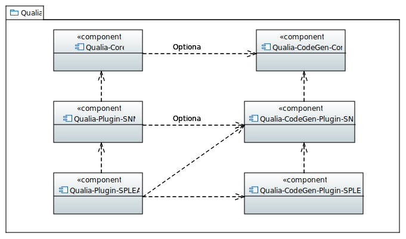

# Qualia components

## Dependency graph

In a UML component diagram, the dotted arrow means "depends on" the component pointed by the arrow.
For example, Qualia-CodeGen-Core is a root dependency.

## Qualia

Documentation: <project:/index.rst>

## Qualia-Core

Documentation: <inv:qualia_core:std:doc#index>

## Qualia-Plugin-SNN

Documentation: <inv:qualia_plugin_snn:std:doc#index>

## Qualia-Plugin-SPLEAT

Documentation: <inv:qualia_plugin_spleat:std:doc#index>

## Qualia-Plugin-SOM

Documentation: <inv:qualia_plugin_som:std:doc#index>

## Qualia-Plugin-Template

Documentation: <inv:qualia_plugin_template:std:doc#index>

## Qualia-CodeGen-Core

Documentation: <inv:qualia_codegen_core:std:doc#index>

## Qualia-CodeGen-Plugin-SNN

Documentation: <inv:qualia_codegen_plugin_snn:std:doc#index>

## Qualia-CodeGen-Plugin-SPLEAT

Documentation: <inv:qualia_codegen_plugin_spleat:std:doc#index>

## Qualia-CodeGen-Plugin-SOM

Documentation: <inv:qualia_codegen_plugin_som:std:doc#index>
