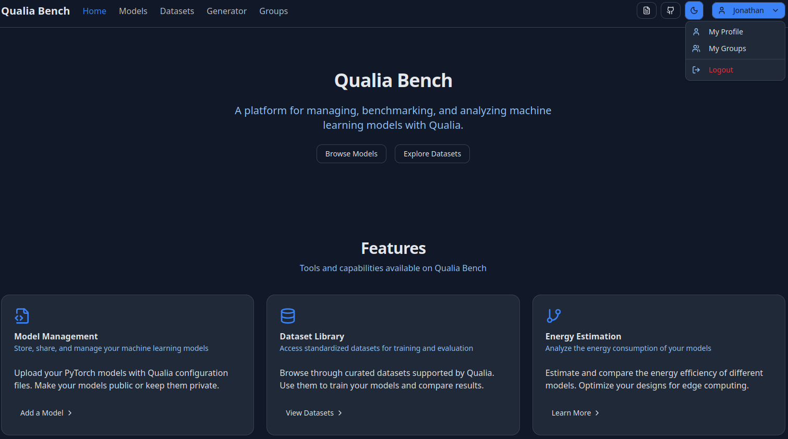

# Getting Started with Qualia-Bench

## Introduction
This guide will walk you through deploying your first SNN on the Qualia-Bench neuromorphic online benchmark with neuromorphic hardware deployment results.  
We'll re-use the model weight and configuration file provided in the [Getting Started SNN](GettingStartedSNN.md) tutorial that you must have followed.

## Prerequisites

Before starting, ensure you have:
- Qualia-Core and have followed the [Installation guide](../../GettingStarted/Installation)
- Qualia-Plugin-SNN and have followed the [Installation guide](InstallationSNN.md)

## Qualia Bench
Qualia Bench is an online platform to benchmark, analyse and compare SNN solutions with and without neuromorphic hardware.  
It allows you to upload your experiment and model weights to run performance, operations, energy and deployment analysis.  
Qualia Bench is publicly accessible at this address: [Qualia Bench](https://qualiabench.univ-cotedazur.fr/).  
Qualia Bench is not a training platform. It only deploys and evaluates models that were previously designed and trained locally with Qualia.

### Login

You can explore Qualia Bench public results without an account. But to upload, evaluate, manage groups and share or download content you need an account.

To create an account you need to contact Pr. Benoît Miramond at <benoit.miramond@univ-cotedazur.fr>.

Once done, click on the connect button on the top right corner.

### Overlook

On the Qualia Bench Home page you can access all the functionalities of the platform.
1. Models: Allows you to see and access all public models or those shared with you.
2. Datasets: Allows you to see all available datasets for the benchmark.
3. Generator: Helps to build configuration files like "config.toml".
4. Groups: Allows you to see all the created and available groups.
5. My Profile: Allows you to check your information and see all your models (private/shared with group / public).
6. My Groups: Allows you to see and manage groups you're in, see other members and share models within the group.



## Upload your first Model
This section is a tutorial to upload your Qualia result in Qualia Bench and get access to the analysis information.

We will use the configuration files provided in the [Getting Started SNN](GettingStartedSNN.md) tutorial that is summarized at the end of this section.

### Prerequisite
For this tutorial you'll need the config.toml file and the network weight available in your directory:
- Trained model weights: `out/learningmodel/gsc_scnn_tutorial_r1.pth`
- config.toml file from the SNN tutorial with the operation counter and energy estimation post processing.

### Upload the model
On "My Profile", in the "My Models" section click on the "Add Model" button.

An "Add New Models" window will open and:
1. Select "Qualia" in the Model Type
2. Upload your "config.toml" in the "Upload Config File" section
3. The platform must detect one model named "gsc_scnn_tutorial".
4. Upload the model weights available at `out/learningmodel/gsc_scnn_tutorial_r1.pth` then click on 'Upload Model'
5. Congratulations, you have now uploaded your first SNN model on Qualia Bench

### Run evaluations
Now you can go to "My Models" and find your 'gsc scnn tutorial' uploaded model.

By clicking on it you'll be redirected to the model interface where you can:
- Rename your model in the 'Action > Edit Name' option
- Edit the configuration file if needed on the configuration (TOML) editor. Do not forget to save your configuration after modification.
- Run CPU Evaluation and SPLEAT Evaluation with the corresponding 'Evaluate' button.
- Lock Model to disable modification and prepare it for benchmarking.

### CPU and SPLEAT Evaluation
In this section two evaluations are available. The CPU will run the model on the server CPU as a test. The SPLEAT evaluation will deploy the SNN model on the SPLEAT neuromorphic accelerator configured on a connected FPGA platform.

The Spiking Low-power Event-based ArchiTecture (SPLEAT) accelerator is a specialised neuromorphic
computing architecture designed for the efficient implementation of spiking neural networks on both ASIC
and FPGA platforms developed by [LEAT](https://leat.univ-cotedazur.fr/edge/ebrain/spleat/).

1. First run the CPU evaluation  
For now, no modifications are needed.  
Click the Evaluate button and wait.  
If the server is running you'll be put in the queue.  
At the end of the run you'll have access to all metrics you've selected in the config file here: 
- Accuracy, parameters
- Operation counter, layerwise activity
- Energy estimation 

You can download all of the csv files to process them locally.

2. Run the SPLEAT evaluation  
To run this network on the FPGA, you need to:
- Update the [Deploy] part. Qualia Bench automatically updates the deploy section. You just need to specify the quantization bitcwidth and the nature of the input load:
```bash
[deploy]
quantize = ["int16"]
converter.params.timestep_mode = "duplicate" 

```

- Then click the 'Evaluate' button.

The evaluation on FPGA is longer due to the Vivado synthesis and hardware deployment.  
Also, only one board is connected and this can limit the speed of the queue.

Also, all the results are available and downloadable.

### Share and compare your results
Now to compare or share your result you'll need to lock the model in the 'Action > Lock Model' option.

Name your model accordingly then Lock it.  
Note that you'll need to rerun the evaluation to be sure it corresponds to the locked config file.

In the 'Action' button you can now choose to:
1. Make it Public (visible to anyone and downloadable by users with an account.)
2. Share it with groups (visible and downloadable by users of the groups.)
